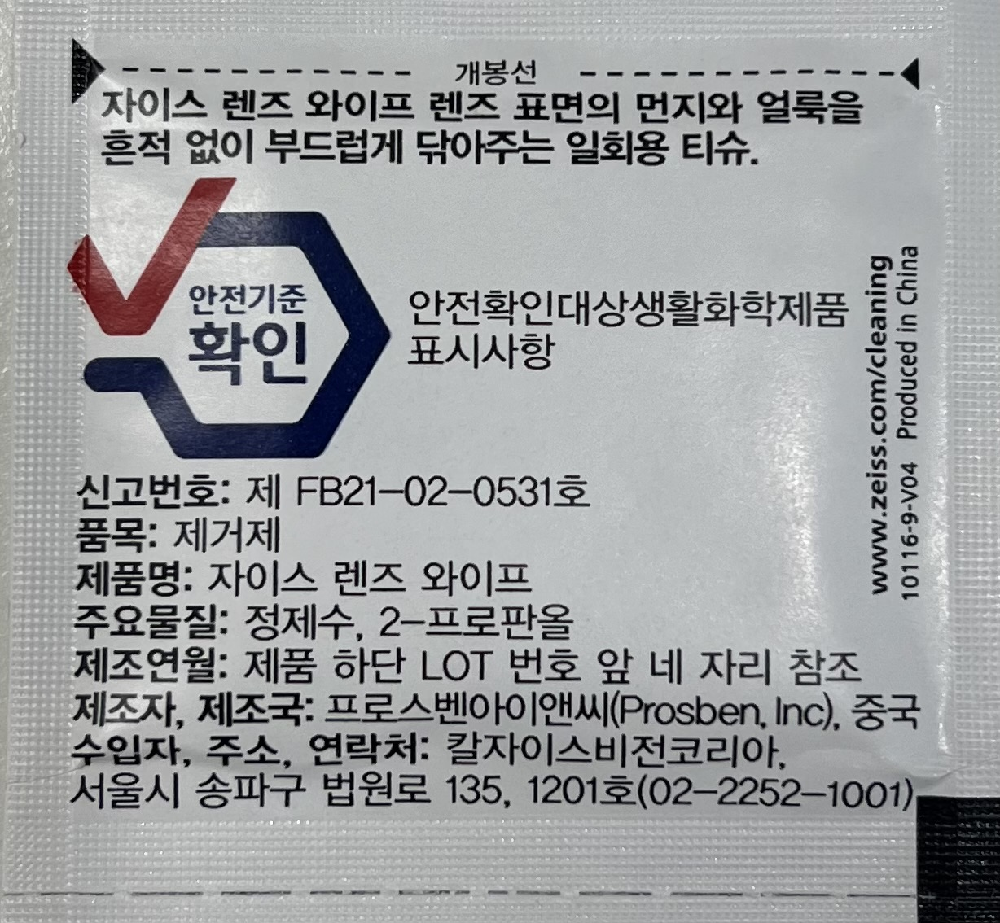
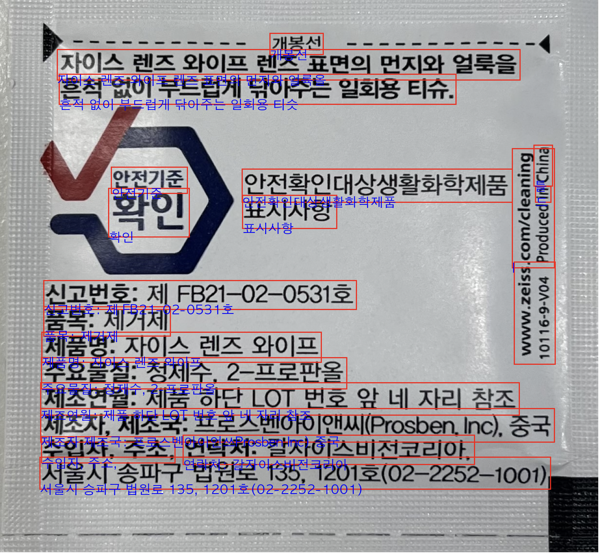
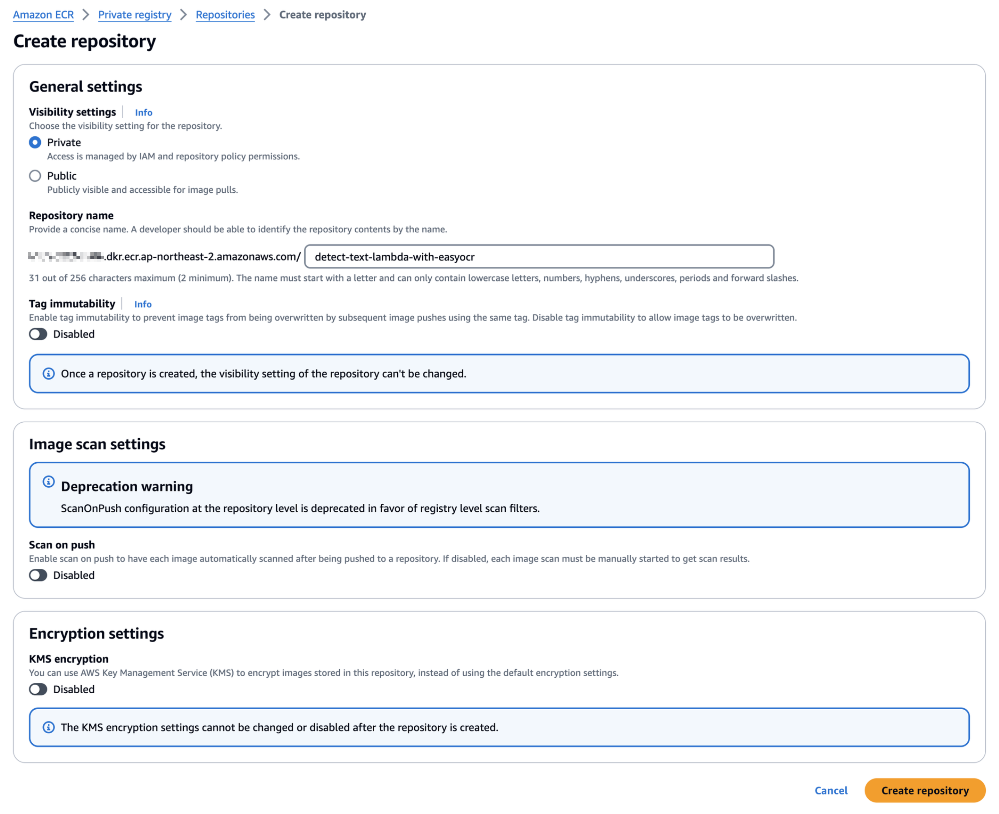
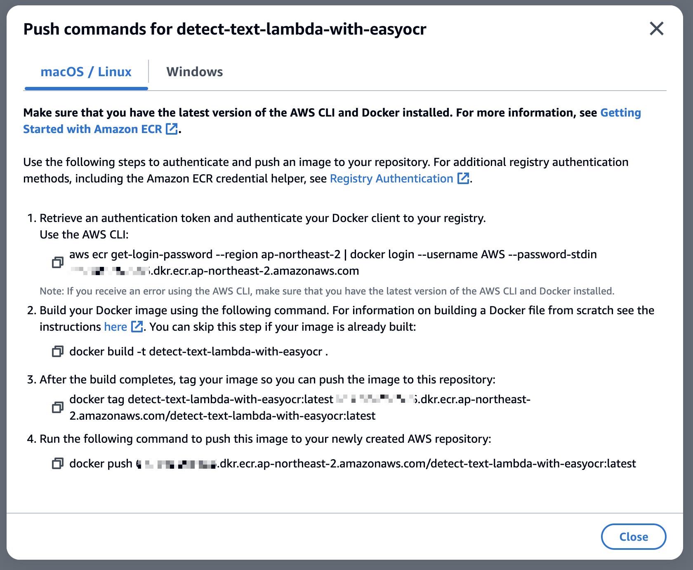
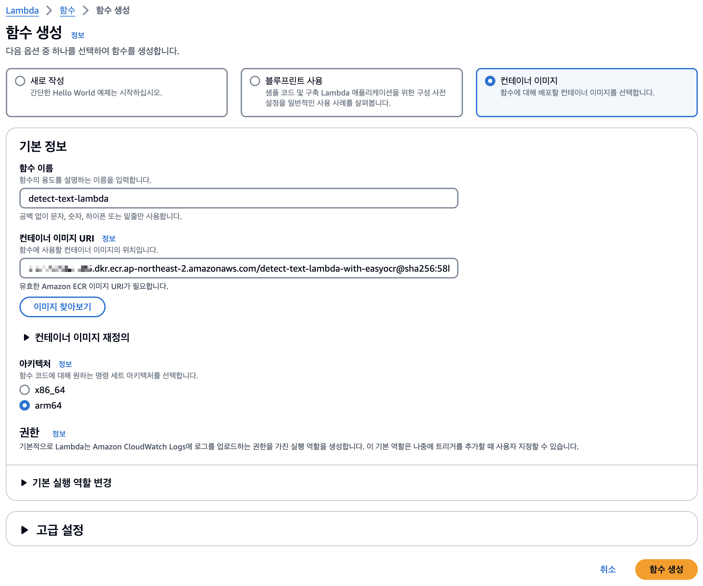

# Detecting text of Image in Amazon S3 with AWS Lambda and EasyOCR

> ⚠️ 해당 가이드 및 코드 샘플은 [Amazon S3](https://aws.amazon.com/ko/s3/)에 저장된 이미지에서 텍스트를 추출하기 위해 오픈소스인 [EasyOCR](https://github.com/JaidedAI/EasyOCR)을 [AWS Lambda](https://aws.amazon.com/ko/pm/lambda/)에 컨테이너 이미지로 배포하는 방법을 안내합니다.

## 주의사항

- [EasyOCR](https://github.com/JaidedAI/EasyOCR)은 80+ 언어를 지원하는 OCR 오픈소스입니다.
- 서버리스로 OCR 기능을 사용하기 위해 AWS Lambda를 사용합니다. **(10240MB 설정 기준 500KB 미만의 이미지 처리 시, 1분 내외 소요)**
- 코드는 단순한 컨테이너 이미지를 통한 람다 배포용입니다.
- 인식 모델 커스텀이 필요한 경우, [EasyOCR Custom Model](https://github.com/JaidedAI/EasyOCR/blob/master/custom_model.md)을 참고해주시기 바랍니다.

---

## Example

### 요청 이미지 및 결과



### 결과 예시

```json
{
  "DetectedText": "개봉선 자이스 렌즈 와이프 렌즈 표면의 먼지와 얼륙올 흔적 없이 부드럽게 닦아주는 일회용 티슷 안전기준 안전확인대상생활화학제품 틀 드 확인 표시사항 l 신고번호: 제 FB21-02-0531호 품목: 제거제  제품명: 자이스 렌즈 와이프 주요물질: 정제수, 2-프로판올 제조연월: 제품 하단 LOT 번호 앞 네 자리 참조 제조자 제조국: 프로스벤아이언쓰Prosben Inc) 중국 수입자, 주소, 연락처: 갈자이스비전코리아 서울시 승파구 법원로 135, 1201호(02-2252-1001)",
  "DetectedResults": [
    {
      "Text": "개봉선",
      "TopLeft": {
        "x": 553,
        "y": 67
      },
      "TopRight": {
        "x": 663,
        "y": 67
      },
      "BottomRight": {
        "x": 663,
        "y": 111
      },
      "BottomLeft": {
        "x": 553,
        "y": 111
      }
    },
    ...
```



### 예시 비용

- 리전: 서울(ap-northeast-2)
- 사용 메모리: 5723MB
- 실행 시간: 50481ms
- 비용: 약 $0.0047

---

## 사전 준비사항

1. [AWS Account](https://aws.amazon.com/ko/resources/create-account/)
2. [AdministratorAccess](https://docs.aws.amazon.com/IAM/latest/UserGuide/getting-started_create-admin-group.html) 권한이 있는 AWS 사용자
    1. 또는 3.에서 생성하는 저장소에 대한 Push 권한이 사용자에게 있어야합니다.
    2. CLI 환경에서 컨테너 이미지를 배포해야하기 때문에 [AWS CLI](https://aws.amazon.com/ko/cli/) 사용 설정이 필요합니다.
3. [Amazon ECR(Elastic Container Registry)](https://aws.amazon.com/ko/ecr/) 저장소 생성
    1. [해당 링크](https://ap-northeast-2.console.aws.amazon.com/ecr/create-repository?region=ap-northeast-2)에서 `detect-text-lambda-with-easyocr` 으로 프라이빗 저장소를 생성합니다.
        
    2. 생성한 저장소의 주소를 복사합니다. (e.g. `YOUR_ACCOUNT_ID.dkr.ecr.ap-northeast-2.amazonaws.com/detect-text-lambda-with-easyocr`)
    3. 생성한 저장소를 클릭하여 [푸시 명령 보기 | View push commands]를 클릭하여 아래와 같이 해당 저장소에 대한 푸시 명령을 확인합니다.
        
4. [Docker](https://www.docker.com/) (로컬 컴퓨터에서 컨테이너를 배포하기 위해 필요합니다.)

---

## 배포 가이드

1. 코드를 내려받습니다.
    
    ```bash
    git clone https://github.com/aws-samples/detect-text-lambda-with-easyocr.git
    ```
    
2. 컨테이너 이미지를 빌드하고 배포합니다. (사전 준비사항의 3. c 참고)
    
    ```bash
    aws ecr get-login-password --region ap-northeast-2 | docker login --username AWS --password-stdin YOUR_ACCOUNT_ID.dkr.ecr.ap-northeast-2.amazonaws.com
    
    docker build -t detect-text-lambda-with-easyocr .
    
    docker tag detect-text-lambda-with-easyocr:latest YOUR_ACCOUNT_ID.dkr.ecr.ap-northeast-2.amazonaws.com/detect-text-lambda-with-easyocr:latest
    
    docker push YOUR_ACCOUNT_ID.dkr.ecr.ap-northeast-2.amazonaws.com/detect-text-lambda-with-easyocr:latest
    ```
    
3. [Lambda - 함수를 생성](https://ap-northeast-2.console.aws.amazon.com/lambda/home?region=ap-northeast-2#/create/function)합니다.
    1. [컨테이너 이미지]탭을 클릭합니다.
    2. 함수의 이름을 입력합니다.
    3. 배포한 컨테이너 이미지 URL를 지정합니다.
    4. **아키텍처는 도커를 통해 빌드한 환경에 맞게 설정합**니다.
        
        
    5. [기본 실행 역할 변경]에서 새 역할을 생성하거나 이미지가 업로드된 S3 버킷에 대한 GetObject 권한이 있는 Lambda용 역할을 선택합니다.
        - **GetObject 정책의 예시**
            
            ```json
            {
                "Version": "2012-10-17",
                "Statement": [
                    {
                        "Effect": "Allow",
                        "Action": "s3:GetObject",
                        "Resource": "arn:aws:s3:::YOUR_S3_BUCKET_NAME/*"
                    }
                ]
            }
            
            ```
            
    6. 함수가 생성된 후, [구성]탭의 [일반 구성]에서 메모리를 10240MB, 제한 시간을 5분으로 설정합니다.
       > ⚠️ EasyOCR은 GPU를 통한 빠른 이미지 분석 기능을 제공하지만 현재 람다에서는 GPU를 사용할 수 없습니다. CPU를 통한 처리를 위해 높은 메모리를 할당했습니다. 경우에 따라 조정하실 수 있습니다. **(10240MB 설정 기준 500KB 미만의 이미지 처리 시, 1분 내외 소요)**
    7. 함수의 [테스트]탭에서 [새 이벤트 생성]을 선택하고 이벤트 이름을 입력합니다.
    8. 아래와 같이 이미지가 저장된 S3 버킷, 객체의 Key, 추출하고자 하는 텍스트의 언어 리스트를 입력합니다.
       >⚠️ EasyOCR에서 탐지 가능한 언어는 [여기](https://www.jaided.ai/easyocr/)에서 확인할 수 있습니다.) 
       ```json
        {
          "Bucket": "YOUR_BUCKET_NAME",
          "Key": "YOUR_IMAGE_KEY",
          "TargetLanguages": [
            "en",
            "ko"
          ]
        }
        ```
        
    9. [저장] 후, [테스트]를 클릭하여 결과를 확인합니다.

---

## **AWS Services and Pricing**

- [AWS Lambda](https://aws.amazon.com/ko/lambda/pricing/)
- [Amazon S3](https://aws.amazon.com/ko/s3/pricing/)
- [Amazon ECR](https://aws.amazon.com/ko/ecr/pricing/)